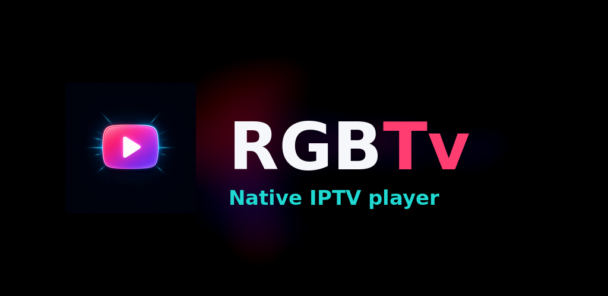

# RGBTv Native IPTV

<p align="center">
  
</p>

Modern native Android IPTV player built with **Kotlin**, **Jetpack Compose Material 3**, and **Media3/ExoPlayer**.

The visual identity is **Neon Cinema**: a dark cinematic canvas, pink-to-violet gradients, cyan accents, large rounded cards, TV-oriented navigation, and high-contrast typography. This is not a WebView application.

## Features

- Native HLS playback with Media3/ExoPlayer and a themed Compose player surface (buffering, play/pause, error state with retry).
- Xtream Codes account login.
- Stalker Portal login with MAC address and handshake.
- M3U playlist URL loading with a forgiving native parser.
- HTTP and HTTPS source support for IPTV providers that expose legacy HTTP endpoints.
- Fast live search while typing (matches channel name and category).
- Automatic category extraction from M3U `group-title` / `#EXTGRP` and Xtream live categories.
- Favorites (persisted across restarts) and a visible "currently playing" highlight.
- Saved sources: the last Xtream/Stalker/M3U source is restored on startup and credentials are
  stored encrypted with AndroidX Security (`EncryptedSharedPreferences`).
- Picture-in-Picture when leaving the app during playback, and a MediaSession so system media
  controls, Bluetooth devices and TV remotes can drive playback.
- Adaptive layout: category rail on tablets/TV, category chips + grid on phones, D-pad focus handling and larger targets on TV.
- Localized UI (**English** and **Arabic**, including RTL) driven by `strings.xml`.
- Loading, empty and error states for every screen state.

## Requirements

- Android Studio Ladybug or newer.
- JDK 17 or newer.
- Android SDK 35.
- Minimum Android version: Android 8.0 / API 26.

## Build

```bash
./gradlew assembleDebug
```

The debug APK is generated at:

```text
app/build/outputs/apk/debug/app-debug.apk
```

> **First-time setup:** this repository ships the Gradle wrapper scripts and
> `gradle/wrapper/gradle-wrapper.properties`, but **not** the binary
> `gradle/wrapper/gradle-wrapper.jar`. Generate it once with a local Gradle 8.10.2 installation:
>
> ```bash
> gradle wrapper --gradle-version 8.10.2
> ```
>
> Opening the project in Android Studio does the same automatically.

CI (`.github/workflows/android.yml`) installs JDK 17, the Android SDK and Gradle 8.10.2 explicitly,
so it does not depend on the wrapper jar either; it uploads a debug APK artifact on every run. Build
artifacts are no longer committed to Git: binaries are published as GitHub release assets instead.

## Adding a source

At startup, the app opens **Add IPTV source**. Choose one of the following tabs:

### Xtream

Enter the provider server URL, username, and password. Both `http://` and `https://` are accepted.

### Stalker

Enter the portal URL and MAC address, for example:

```text
00:1A:79:XX:XX:XX
```

Both `:` and `-` separators are accepted, and lowercase hex is normalized automatically.

### M3U

Enter an HTTP or HTTPS playlist URL. The playlist parser reads channel names, logos, groups, and
stream URLs, including entries without `#EXTINF` attributes and names that contain commas.

## HTTP compatibility warning

Cleartext HTTP is intentionally enabled because many IPTV providers and Stalker portals do not
provide HTTPS. HTTP is vulnerable to interception: credentials and stream URLs travel in plain text.
Use HTTPS whenever the provider supports it, and avoid entering credentials on untrusted networks.
The connection dialog shows this warning before you connect.

## Project structure

```text
app/src/main/java/com/rgbtv/app/
├── MainActivity.kt                 # Activity, edge-to-edge setup, adaptive root layout
├── data/
│   ├── M3uParser.kt                # Native M3U parser (attributes, #EXTGRP, bare URLs)
│   ├── ProfileStore.kt             # Saved sources + favorites (SharedPreferences + org.json)
│   └── SecureCredentials.kt        # Encrypted credentials (AndroidX Security)
├── model/Models.kt                 # Channels, profiles, player state, UI messages
└── ui/
    ├── MainViewModel.kt            # Sources, filtering, favorites, errors (string-res based)
    ├── Theme.kt                    # Neon Cinema Material 3 theme (colors, type, shapes)
    ├── util/Layout.kt              # Window size class + TV/touch device detection
    └── components/                 # Top bar, category nav, hero player, cards, dialog, states
```

## Brand assets

| Asset | File | Size |
|---|---|---|
| Launcher icon (adaptive foreground) | `app/src/main/res/mipmap-anydpi-v26/ic_launcher_foreground.png` | 432×432 (108 dp @ xxxhdpi) |
| Android TV banner | `app/src/main/res/drawable-{xhdpi,xxhdpi}/tv_banner.png` | 320×180 dp |
| Store feature graphic | `art/feature-graphic-1024x500.png` | 1024×500 |
| Sources + build script | `art/source-*.png`, `art/build-assets.sh` | regenerate with `./build-assets.sh` (ImageMagick) |

The launcher mark is a rounded TV emblem with a hot-pink → violet neon gradient and a white play
triangle on a midnight canvas, kept inside the adaptive safe zone with margins on every side. The
banner and feature graphic re-use the generated artwork as a blurred neon backdrop and draw the
`RGBTv` wordmark with a real font, so no lettering is ever garbled.

## Notes

This repository contains a working native foundation with persisted sources and favorites. Before
production distribution, add offline catalogue/history storage (Room can replace `ProfileStore`),
foreground playback with a `MediaSessionService` and notification so audio survives leaving the
screen, EPG integration, stronger provider-specific error handling and pagination, Android TV remote
testing, and a release signing key managed outside the repository.

Do not commit provider usernames, passwords, MAC addresses, tokens, or private playlists.
